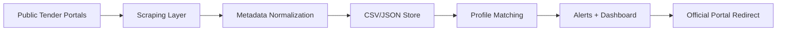

# 📡 TenderScan

Automated Government Tender Intelligence for South African Tenderpreneurs.

A lightweight tender scraping and aggregation system that helps SMMEs, contractors, and service providers discover relevant government opportunities faster, without the manual search hassle.

## 📊 Executive Summary & Overview

For stakeholder-facing project context, see:

- [`docs/executive_summary_overview.md`](docs/executive_summary_overview.md)

## 🎯 Mission

Reduce tender discovery time from hours to minutes by:

- Scraping public tender portals (`eTenders.gov.za`, provincial bulletins, SETA portals)
- Filtering opportunities by user profile (sector, CIDB grade, location, keywords)
- Delivering personalised alerts and dashboard views
- Guiding users to official sources for document downloads

## 🚀 Features (MVP Scope)

| Feature | Description | Status |
|---|---|---|
| Tender Scraping | Extract metadata from `eTenders.gov.za` + aggregators | 🟡 In Progress |
| Search-Optimized Tracker | Keywords, entity clues, closing dates, contact info | ✅ Done |
| User Profiles | Sector, CIDB grading, province, budget range | 🔲 Planned |
| Smart Filtering | Match tenders to user profile automatically | 🔲 Planned |
| Email Alerts | Notify users when new tenders match their criteria | 🔲 Planned |
| Dashboard UI | “My Tenders”, deadline calendar, saved items | 🔲 Planned |
| Compliance Tracker | CSD, Tax Clearance, B-BBEE status checklist | 🔲 Planned |

## 🛠️ Tech Stack

| Layer | Technology | Purpose |
|---|---|---|
| Language | Python 3.10+ | Core scraping & automation logic |
| Environment | Jupyter Notebook | Interactive prototyping & testing |
| Libraries | `requests`, `BeautifulSoup4`, `Selenium` | HTML parsing & dynamic content |
| Data Storage | CSV/JSON (Phase 1) → PostgreSQL (Phase 2) | Structured tender metadata |
| Backend | Node.js/Express OR Django REST | API layer (future) |
| Frontend | Next.js + Tailwind | User dashboard (future) |
| Auth | NextAuth.js / Django AllAuth | Multi-tenant user management |
| Alerts | Resend/SendGrid + Twilio (optional) | Email/SMS notifications |
| Hosting | Vercel (frontend) + Render/Railway (backend) | Deployment |

## 📁 Project Structure

```text
tenderscan-mvp/
├── README.md
├── notebooks/
├── scripts/
└── docs/
	└── executive_summary_overview.md
```

## ⚙️ Setup Instructions

### 1) Clone the repository

```bash
git clone https://github.com/kpmatlakala/tenderscan-mvp.git
cd tenderscan-mvp
```

### 2) Create a virtual environment

```bash
python -m venv venv
```

- On Windows (PowerShell):

```powershell
venv\Scripts\Activate.ps1
```

- On macOS/Linux:

```bash
source venv/bin/activate
```

### 3) Install dependencies

```bash
pip install requests beautifulsoup4 selenium jupyter
```

### 4) Run the scraper prototype

```bash
jupyter notebook
```

Open the notebook in the `notebooks/` folder.

## 📊 Data Workflow



## ⚠️ Compliance & Ethics

| Consideration | Our Approach |
|---|---|
| Data Usage | Scrape public metadata only (no PDF hosting). Attribute source: “Data sourced from National Treasury eTender Portal”. |
| Rate Limiting | Implement delays (`time.sleep`) between requests and respect `robots.txt`. |
| POPIA | User data encrypted at rest; privacy policy and data deletion requests supported. |
| Terms of Service | Users remain responsible for eligibility checks and submissions via official portals. |
| Document Links | Guide users to download from official sources using pre-filled search keywords. |

**Key principle:** We aggregate public metadata to save time, not redistribute documents. Users still engage with the official source.

## 🗓️ Roadmap

| Phase | Deliverable | Timeline |
|---|---|---|
| Phase 1 | Jupyter prototype + CSV export | Weeks 1–2 |
| Phase 2 | PostgreSQL DB + basic filter engine | Weeks 3–5 |
| Phase 3 | Email alerts + user auth | Weeks 6–8 |
| Phase 4 | Dashboard UI (Next.js) | Weeks 9–12 |
| Phase 5 | Payment integration + public launch | Weeks 13+ |

## 📝 Current Trackers (Manual Phase)

| Category | Status | Location |
|---|---|---|
| ICT/Digital Skills Tenders | ✅ Compiled | Google Sheets |
| Civil Engineering Tenders | ✅ Compiled | Google Sheets |
| Electrical Tenders | ✅ Compiled | Google Sheets |
| SETA Discretionary Grants | ✅ Researched | Google Sheets |
| Provincial (Limpopo) Tenders | ✅ Compiled | Google Sheets |

## 🤝 Contributors

| Name | Role | Contact |
|---|---|---|
| Kabelo Matlakala | Dev | +27 72 713 8367 |
| Arehone Matodzi | Technical Advisor | TBD |
| GT Thosago | Stakeholder | TBD |
| Katlego Thosago | Stakeholder | TBD |

Current collaborator invite:

- `@ArehoneMatodzi-Alternative` — Pending invite response

## 📧 Contact & Support

- Email: Matlakalakabelo1@gmail.com
- GitHub: <https://github.com/kpmatlakala>
- Phone: +27 72 713 8367

## 📄 License

This repository currently includes an MIT license file. If you want to move to a proprietary license model, update the `LICENSE` file to match this README policy statement.

Built with ❤️ for South African Tenderpreneurs.

Last Updated: 20 February 2026
