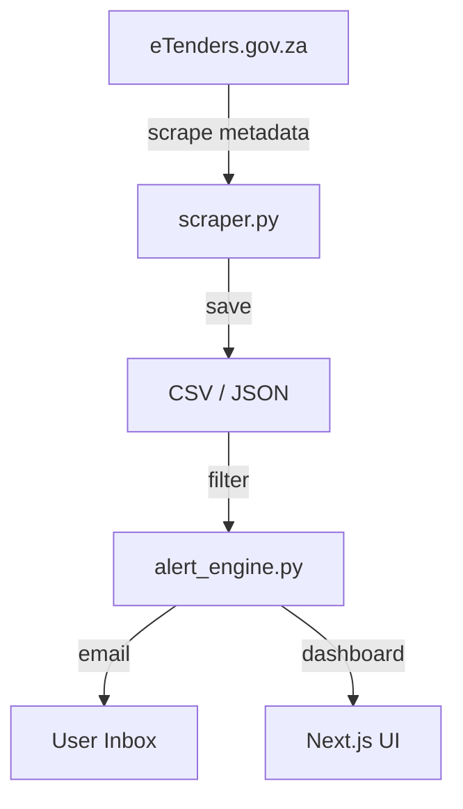

# TenderScan
**Automated Government Tender Intelligence for South African Tenderpreneurs**

A lightweight tender scraping and aggregation system that helps SMMEs, contractors, and service providers discover relevant government opportunities faster — without the manual search hassle.

---

## 🎯 Mission

Reduce tender discovery time from hours to minutes by:

- Scraping public tender portals (eTenders.gov.za, provincial bulletins, SETA portals)
- Filtering opportunities by user profile (sector, CIDB grade, location, keywords)
- Delivering personalised alerts + dashboard views
- Guiding users to official sources for document downloads

---

## 🚀 Features (MVP Scope)

| Feature | Description | Status |
|---|---|---|
| Tender Scraping | Extract metadata from eTenders.gov.za + aggregators | 🟡 In Progress |
| Search-Optimized Tracker | Keywords, entity clues, closing dates, contact info | ✅ Done |
| User Profiles | Sector, CIDB grading, province, budget range | 🔲 Planned |
| Smart Filtering | Match tenders to user profile automatically | 🔲 Planned |
| Email Alerts | Notify users when new tenders match their criteria | 🔲 Planned |
| Dashboard UI | "My Tenders", deadline calendar, saved items | 🔲 Planned |
| Compliance Tracker | CSD, Tax Clearance, B-BBEE status checklist | 🔲 Planned |

---

## 🛠️ Tech Stack

| Layer | Technology | Purpose |
|---|---|---|
| Language | Python 3.10+ | Core scraping & automation logic |
| Environment | Jupyter Notebook | Interactive prototyping & testing |
| Libraries | requests, BeautifulSoup4, Selenium | HTML parsing & dynamic content |
| Data Storage | CSV/JSON (Phase 1) → PostgreSQL (Phase 2) | Structured tender metadata |
| Backend | Node.js/Express OR Django REST | API layer (future) |
| Frontend | Next.js + Tailwind | User dashboard (future) |
| Auth | NextAuth.js / Django AllAuth | Multi-tenant user management |
| Alerts | Resend/SendGrid + Twilio (optional) | Email/SMS notifications |
| Hosting | Vercel (frontend) + Render/Railway (backend) | Deployment |

---

## 📁 Project Structure

```
tenderscan-mvp/
├── README.md                       # This file
├── requirements.txt                # Python dependencies
├── notebooks/                      # Jupyter scraping prototypes
│   └── etenders_scraper.ipynb
├── scripts/                        # Production-ready Python scripts
│   ├── scraper.py
│   └── alert_engine.py
└── docs/                           # Meeting notes, specs, tracker exports
    ├── mission_brief.md
    └── compliance_notes.md
```

---

## ⚙️ Setup Instructions

### 1. Clone the Repository

```bash
git clone https://github.com/kpmatlakala/TenderScan.git
cd TenderScan
```

### 2. Create Virtual Environment

```bash
python -m venv venv
source venv/bin/activate  # On Windows: venv\Scripts\activate
```

### 3. Install Dependencies

```bash
pip install -r requirements.txt
```

### 4. Run the Scraper (Prototype)

```bash
jupyter notebook
# Open notebooks/etenders_scraper.ipynb
```

---

## 📊 Data Workflow



---

## ⚠️ Compliance & Ethics

| Consideration | Our Approach |
|---|---|
| Data Usage | Scrape public metadata only (no PDF hosting). Attribute source: "Data sourced from National Treasury eTender Portal" |
| Rate Limiting | Implement delays (`time.sleep`) between requests. Respect `robots.txt` |
| POPIA | User data encrypted at rest. Privacy policy + data deletion requests supported |
| Terms of Service | Users responsible for verifying eligibility + submitting applications via official portals |
| Document Links | Guide users to download from official source using pre-filled search keywords |

> **Key Principle:** We aggregate public metadata to save time — not redistribute documents. Users still engage with the official source.

---

## 🗓️ Roadmap

| Phase | Deliverable | Timeline |
|---|---|---|
| Phase 1 | Jupyter prototype + CSV export | Weeks 1–2 |
| Phase 2 | PostgreSQL DB + basic filter engine | Weeks 3–5 |
| Phase 3 | Email alerts + user auth | Weeks 6–8 |
| Phase 4 | Dashboard UI (Next.js) | Weeks 9–12 |
| Phase 5 | Payment integration + public launch | Weeks 13+ |

---

## 📝 Current Trackers (Manual Phase)

| Category | Status | Location |
|---|---|---|
| ICT/Digital Skills Tenders | ✅ Compiled | Google Sheets |
| Civil Engineering Tenders | ✅ Compiled | Google Sheets |
| Electrical Tenders | ✅ Compiled | Google Sheets |
| SETA Discretionary Grants | ✅ Researched | Google Sheets |
| Provincial (Limpopo) Tenders | ✅ Compiled | Google Sheets |

---

## 🤝 Contributors

| Name | Role | Contact |
|---|---|---|
| Kabelo Matlakala | Full-Stack Dev | +27 72 713 8367 |
| Arehone | Technical Advisor | TBD |
| GT Thosago | Stakeholder | TBD |

---

## 📧 Contact & Support

- GitHub: [github.com/kpmatlakala](https://github.com/kpmatlakala)

---

## 📄 License

Proprietary — All rights reserved. This project is under active development for DSA (Digital Skills Academy) and related stakeholders. Do not redistribute without permission.

---

*Built with ❤️ for South African Tenderpreneurs*

**Last Updated:** 20 February 2026
